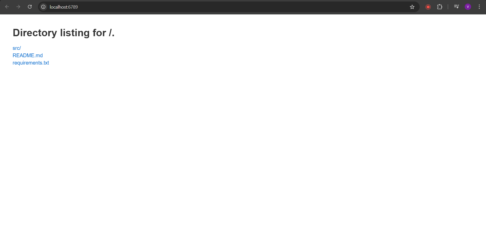
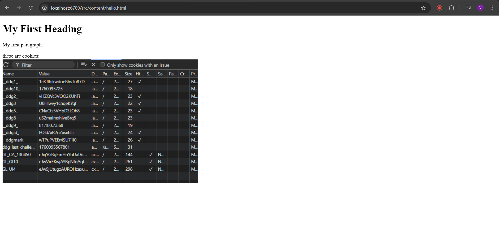
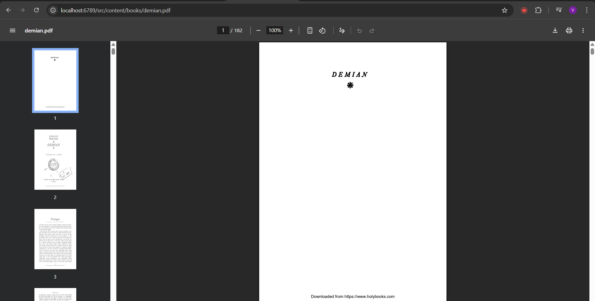
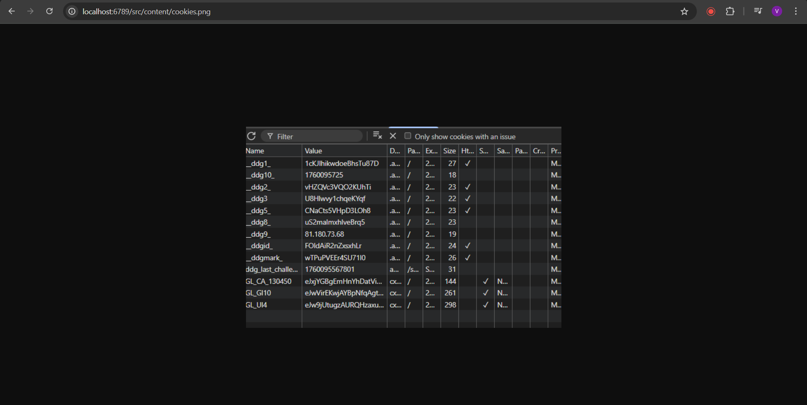
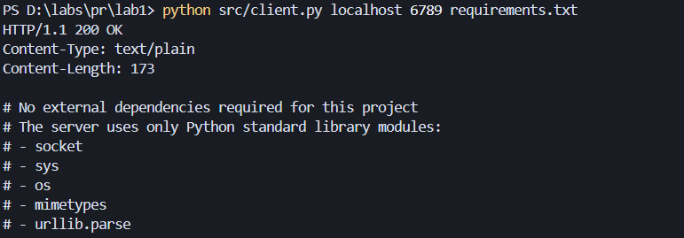
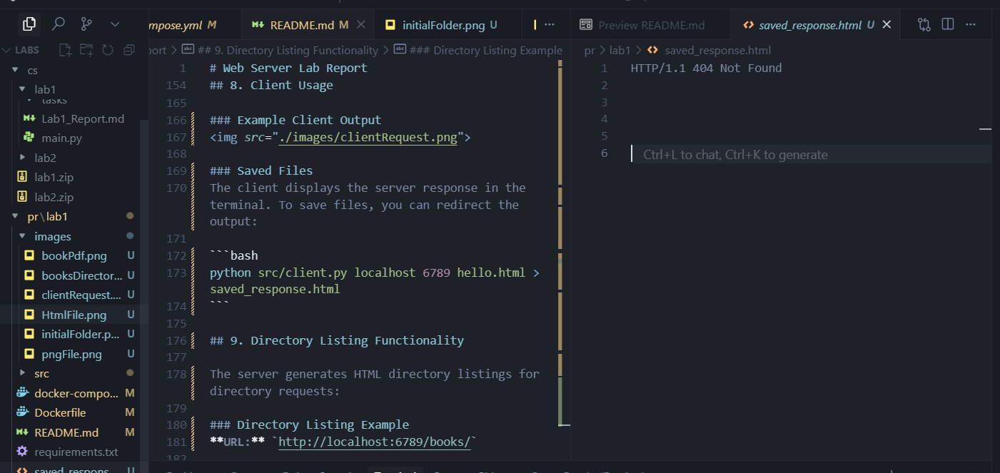
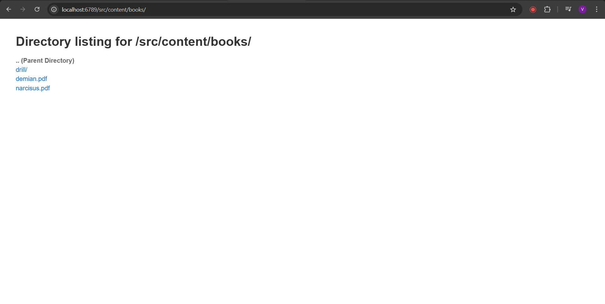
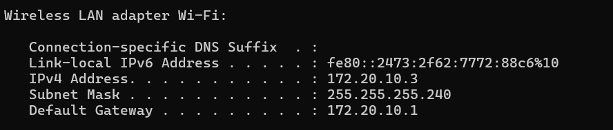
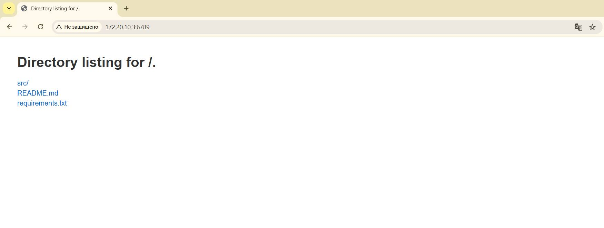

## PR LAB 1
### Vitcovschii Vladimir FAF-231

## Web Server Lab Report

This lab implements a basic HTTP web server in Python using socket programming with Docker containerization.

## 1. Contents of Source Directory

```
src/
├── client.py          # HTTP client for testing the server
├── server.py          # Main web server implementation
└── content/           # Directory served by the web server
    ├── books/
    │   ├── demian.pdf
    │   ├── narcisus.pdf
    │   └── drill/
    │       └── deeper/
    │           └── into/
    │               └── core/
    ├── cookies.png
    ├── hello.html     # HTML file with embedded image
    ├── images/
    │   └── cookie.png
    └── pdfs/
        └── Lucrare de laborator nr. 2 Criptanaliza cifrurilor monoalfabetice (2).pdf
```



## 2. Docker Compose File

```yaml
version: '3.8'

services:
  web-server:
    build: .
    ports:
      - "0.0.0.0:6789:6789"  # Bind to all interfaces for external access
    volumes:
      - ./src/content:/lab1/src/content:ro
    restart: unless-stopped
    environment:
      - PYTHONUNBUFFERED=1
```

## 3. Dockerfile

```dockerfile
FROM python:3.13-slim
WORKDIR /lab1

COPY requirements.txt .
RUN pip install --no-cache-dir -r requirements.txt

COPY . .

RUN useradd -m labuser && chown -R labuser:labuser /lab1
USER labuser

EXPOSE 6789

CMD ["python", "src/server.py"]
```

## 4. How to Start the Container

To build and start the web server container:

```bash
# Build and start the container
docker compose up --build

# Or run in detached mode
docker compose up -d --build
```

The server will be accessible at:
- `http://localhost:6789`
- `http://0.0.0.0:6789`
- `http://<network-ip>:6789` (external access)

## 5. Server Command with Directory Argument

The server runs with the following command inside the container:

```bash
python src/server.py
```

The server automatically serves files from the `src/content` directory, which is mounted as a read-only volume in the container. The server accepts a directory path as an argument through the HTTP request URL.

## 6. Contents of Served Directory

The web server serves files from the `src/content` directory:

```
content/
├── books/                    
│   ├── demian.pdf          # PDF file
│   ├── narcisus.pdf        # PDF file  
│   └── drill/              # Nested subdirectory
│       └── deeper/
│           └── into/
│               └── core/
├── cookies.png            
├── hello.html             
├── images/                 # Images subdirectory
│   └── cookie.png         # PNG image file
└── pdfs/                   
    └── Lucrare de laborator nr. 2 Criptanaliza cifrurilor monoalfabetice (2).pdf
```

## 7. Browser Requests for 4 Different File Types

### 7.1 Inexistent File (404 Error)
**URL:** `http://localhost:6789/nonexistent.html`

**Expected Response:**
```
HTTP/1.1 404 Not Found
```

### 7.2 HTML File with Image
**URL:** `http://localhost:6789/hello.html`

**Content:** HTML file that includes an embedded image reference:
```html
<!DOCTYPE html>
<html>
<body>
<h1>My First Heading</h1>
<p>My first paragraph.</p>
<div>these are cookies:</div>

</body>
</html>
```



### 7.3 PDF File
**URL:** `http://localhost:6789/books/demian.pdf`

**Response:** Serves the PDF file with proper `Content-Type: application/pdf` header.



### 7.4 PNG File
**URL:** `http://localhost:6789/cookies.png`

**Response:** Serves the PNG image file with proper `Content-Type: image/png` header.



## 8. Client Usage

### How to Run the Client

```bash
# From the host machine (outside container)
python src/client.py localhost 6789 hello.html

# Or from inside the container
docker-compose exec web-server python src/client.py localhost 6789 hello.html
```

### Example Client Output


### Saved Files
The client displays the server response in the terminal. To save files, you can redirect the output:

```bash
python src/client.py localhost 6789 hello.html > saved_response.html
```


## 9. Directory Listing Functionality

The server generates HTML directory listings for directory requests:

### Directory Listing Example
**URL:** `http://localhost:6789/books/`



**Generated HTML:**
```html
<!DOCTYPE html>
<html>
<head>
    <title>Directory listing for /books</title>
    <style>
        body { font-family: Arial, sans-serif; margin: 40px; }
        h1 { color: #333; }
        ul { list-style-type: none; padding: 0; }
        li { margin: 5px 0; }
        a { text-decoration: none; color: #0066cc; }
        a:hover { text-decoration: underline; }
        .parent { font-weight: bold; color: #666; }
    </style>
</head>
<body>
    <h1>Directory listing for /books</h1>
    <ul>
        <li><a href="/" class="parent">.. (Parent Directory)</a></li>
        <li><a href="/books/drill/">drill/</a></li>
        <li><a href="/books/demian.pdf">demian.pdf</a></li>
        <li><a href="/books/narcisus.pdf">narcisus.pdf</a></li>
    </ul>
</body>
</html>
```

## 10. Browsing friends(mine) site on the network

Can't browse the friends site, so browsed mine from another device.

I use the cmd command ipconfig to get the current ip on the network



And this is what I browsed on the another PC on same network:



