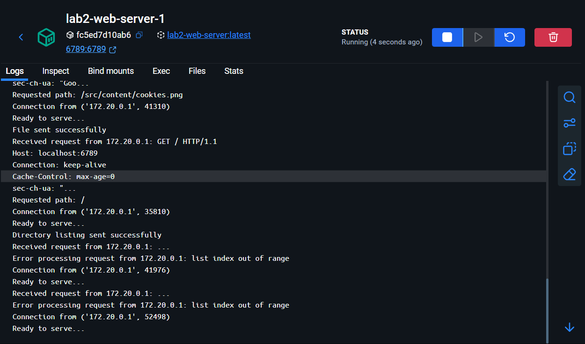
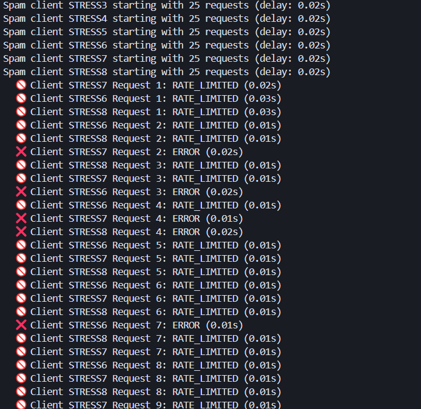
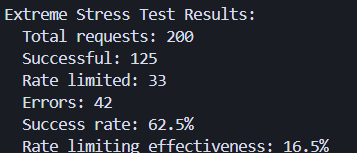
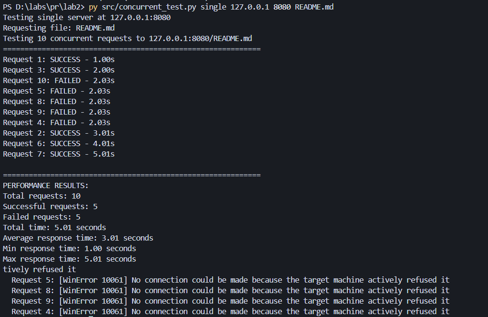
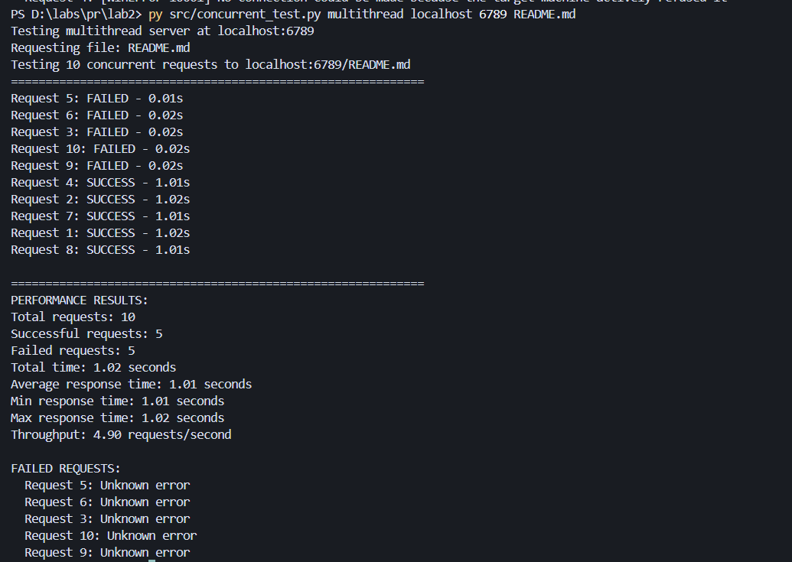

## PR LAB 2
### Vitcovschii Vladimir FAF-231

## Multithreaded Web Server Lab Report

This lab implements a multithreaded HTTP web server in Python with advanced features including request counters, rate limiting, and thread-safe operations.

## Lab 2: Concurrent HTTP Server - Task Description

### Theoretical Background

This lab focuses on understanding and implementing concurrency in web servers. The lab is based on the following resources:
- [MIT 6.102 Concurrency Introduction](https://web.mit.edu/6.102/www/sp25/classes/14-concurrency/)
- Section 4.3 from the concurrency article
- Definitions from the concurrency glossary
- (Optional) The Art of Multiprocessor Programming

### Important Note on Concurrency Definitions

There are two "correct" definitions of concurrency depending on the school of thought:

**OS (Low-level) Tradition:**
- **Concurrency** = tasks overlap in time (including by interleaving)
- **Parallelism** = tasks run simultaneously (on multiple processors)
- Parallel implies Concurrent
- All parallel tasks are also concurrent
- Not all concurrent tasks are parallel

**PLT (High-level) Tradition:**
- **Concurrency** is a language concept: constructing a program as independent parts
- **Parallelism** is a hardware concept: executing computations on multiple processors simultaneously
- Parallelism and Concurrency are orthogonal
- A concurrent program may or may not execute in parallel
- A parallel computation may or may not have the notion of concurrency in its structure

The high-level view of concurrency is becoming more predominant, and this lab follows the second school of thought.

### Lab Tasks

#### 1. Multithreaded Server Implementation
**Objective:** Make the HTTP server multithreaded to handle multiple connections concurrently.

**Requirements:**
- Implement either thread-per-request or thread pool approach
- Add a delay to the request handler to simulate work (~1s)
- Test with 10 concurrent requests and measure handling time
- Compare performance with single-threaded server from previous lab

#### 2. Request Counter Feature (2 points)
**Objective:** Record the number of requests made to each file and display in directory listing.

**Implementation Steps:**
1. **Naive Implementation:** Implement counter without synchronization
2. **Race Condition Demonstration:** Show race condition by adding delays to force thread interleaving
3. **Thread-Safe Implementation:** Use synchronization mechanism (e.g., locks) to eliminate race conditions
4. **Directory Listing Integration:** Display request counts in directory listings

**Example Output:**
```
README.md (5 requests)
books/demian.pdf (12 requests)
```

#### 3. Rate Limiting Implementation (2 points)
**Objective:** Implement thread-safe rate limiting by client IP (~5 requests/second).

**Requirements:**
- Rate limit of approximately 5 requests per second per client IP
- Thread-safe implementation
- Test with two scenarios:
  - One friend spamming requests (should be rate-limited)
  - Another friend sending requests just below the rate limit (should succeed)
- Compare throughput for both scenarios (successful requests/second)

**Expected Behavior:**
- Spam requests should receive HTTP 429 (Too Many Requests) responses
- Normal requests should be processed successfully
- Rate limiting should be enforced per IP address
- Thread-safe implementation to prevent race conditions

### Performance Testing Requirements

#### Concurrent Request Testing
- Make 10 concurrent requests to both servers
- Measure total time for all requests to complete
- Compare multithreaded vs single-threaded performance
- Expected: Multithreaded should handle requests in ~1-2 seconds, single-threaded in ~10+ seconds

#### Race Condition Testing
- Demonstrate naive counter implementation without synchronization
- Show lost increments due to thread interference
- Implement thread-safe solution with locks
- Verify race condition elimination

#### Rate Limiting Testing
- Test with aggressive client (spam requests)
- Test with normal client (below rate limit)
- Measure successful requests per second for each scenario
- Verify HTTP 429 responses for rate-limited requests

## 1. Contents of Source Directory

```
src/
├── client.py                    # HTTP client for testing the server
├── server.py                    # Multithreaded web server implementation
├── server_single_threaded.py   # Single-threaded server for comparison
├── concurrent_test.py           # Test script for concurrent requests
├── race_condition_demo.py       # Demonstrates race conditions
├── rate_limit_test.py          # Tests rate limiting functionality
└── content/                     # Directory served by the web server
    ├── books/
    │   ├── demian.pdf
    │   ├── narcisus.pdf
    │   └── drill/
    │       └── deeper/
    │           └── into/
    │               └── core/
    ├── cookies.png
    ├── README.md     # HTML file with embedded image
    ├── images/
    │   └── cookie.png
    └── pdfs/
        └── Lucrare de laborator nr. 2 Criptanaliza cifrurilor monoalfabetice (2).pdf
```


## 2. Docker Compose File

```yaml
version: '3.8'

services:
  web-server:
    build: .
    ports:
      - "0.0.0.0:6789:6789"  # Bind to all interfaces for external access
    volumes:
      - ./src/content:/lab1/src/content:ro
    restart: unless-stopped
    environment:
      - PYTHONUNBUFFERED=1
```

## 3. Dockerfile

```dockerfile
FROM python:3.13-slim
WORKDIR /lab1

COPY requirements.txt .
RUN pip install --no-cache-dir -r requirements.txt

COPY . .

RUN useradd -m labuser && chown -R labuser:labuser /lab1
USER labuser

EXPOSE 6789

CMD ["python", "src/server.py"]
```

### 4. Multithreading Implementation

The server now uses threading to handle multiple concurrent connections:

```python
# Create a new thread to handle the request
thread = threading.Thread(target=handle_request, args=(connectionSocket, addr))
thread.daemon = True  # Allow main thread to exit even if threads are running
thread.start()
```


### 5. Request Counter Feature

The server tracks the number of requests made to each file and displays them in directory listings:


### 6. Rate Limiting Implementation

Thread-safe rate limiting by client IP:

```python
def check_rate_limit(client_ip):
    current_time = time.time()
    
    with rate_limit_lock:
        # Clean old timestamps
        rate_limit_data[client_ip] = [
            timestamp for timestamp in rate_limit_data[client_ip]
            if current_time - timestamp < RATE_LIMIT_WINDOW
        ]
        
        # Check if under rate limit (5 requests/second)
        if len(rate_limit_data[client_ip]) < RATE_LIMIT_REQUESTS:
            rate_limit_data[client_ip].append(current_time)
            return True
        else:
            return False
```



#### Rate Limiting Testing

```bash
python src/rate_limit_test.py localhost 6789 README.md
```





### Single threaded and multithreaded comparison




#### Running Tests

```bash
# Performance comparison
python src/concurrent_test.py multithreaded localhost 6789 README.md
python src/concurrent_test.py single localhost 8080 README.md

# Race condition demonstration
python src/race_condition_demo.py localhost 6789 README.md

# Rate limiting tests
python src/rate_limit_test.py localhost 6789 README.md
```


